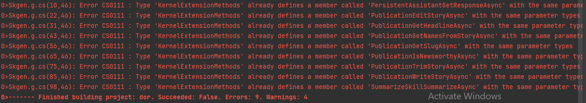

# Overview
This is a source generator which finds Semantic Kernel plugins and generates helper static extension methods for calling them with all the right inputs.

Semantic Kernel plugins are stringly-typed, and it's easy to forget a variable or two when calling them:

A typical Semantic Kernel project defines its prompt-based plugins in a folder called Plugins:
.
├── Plugins/
│   ├── Summarize/
│   │   └── SummarizeText/
│   │       ├── config.json
│   │       └── skprompt.txt
│   └── Assistant/
│       └── GetResponse/
│           ├── config.json
│           └── skprompt.txt
└── Program.cs

```json
{
  "schema": 1,
  "description": "Summarize given text or any text document",
  "execution_settings": {
    "default": {
      "max_tokens": 512,
      "temperature": 0.0,
      "top_p": 0.0,
      "presence_penalty": 0.0,
      "frequency_penalty": 0.0
    }
  },
  "input_variables": [
    {
      "name": "input",
      "description": "Text to summarize",
      "default": "",
      "is_required": true
    }
  ]
}
```

```txt
[SUMMARIZATION RULES]
DONT WASTE WORDS
USE SHORT, CLEAR, COMPLETE SENTENCES.
DO NOT USE BULLET POINTS OR DASHES.
USE ACTIVE VOICE.
MAXIMIZE DETAIL, MEANING
FOCUS ON THE CONTENT

[BANNED PHRASES]
This article
This document
This page
This material
[END LIST]

Summarize:
Hello how are you?
+++++
Hello

Summarize this
{{$input}}
+++++
```

This source generator goes through and finds every file called `config.json` and generates static extension methods for Microsoft.SemanticKernel.Kernel that look like this:
```csharp
// <auto-generated/>
using System;
using Microsoft.SemanticKernel;

namespace Skgen;

public static partial class KernelExtensionMethods
{
    
    public static async Task<FunctionResult> PersistentAssistantGetResponseAsync(this Kernel kernel, string prompt = "", string snippet0 = "", string snippet1 = "", string snippet2 = "", CancellationToken cancellationToken = default(CancellationToken))
    {
        var arguments = new KernelArguments();
        arguments["prompt"] = prompt;
		arguments["snippet0"] = snippet0;
		arguments["snippet1"] = snippet1;
		arguments["snippet2"] = snippet2;
    
        var answer = await kernel.InvokeAsync("PersistentAssistant", "GetResponse", arguments, cancellationToken);
        return answer;
    }

    public static async Task<FunctionResult> SummarizePluginSummarizeAsync(this Kernel kernel, string input = "", string chunk = "", string totalChunks = "", string fact1 = "", string fact2 = "", string fact3 = "", CancellationToken cancellationToken = default(CancellationToken))
    {
        var arguments = new KernelArguments();
        arguments["input"] = input;
		arguments["chunk"] = chunk;
		arguments["totalChunks"] = totalChunks;
		arguments["fact1"] = fact1;
		arguments["fact2"] = fact2;
		arguments["fact3"] = fact3;
    
        var answer = await kernel.InvokeAsync("SummarizePlugin", "Summarize", arguments, cancellationToken);
        return answer;
    }
}
```

# Getting started
install the package `dotnet add package Skgen`

By default, the source generated code is not persisted to disk. In order to persist it to a file called Generated, you can add this to your csproj:

```xml
<PropertyGroup>
        <EmitCompilerGeneratedFiles>true</EmitCompilerGeneratedFiles>
        <CompilerGeneratedFilesOutputPath>Generated</CompilerGeneratedFilesOutputPath>
</PropertyGroup>

<ItemGroup>
    <Compile Remove="$(CompilerGeneratedFilesOutputPath)/**/*.cs" />
</ItemGroup>
```

Thank you to Andrew Lock for [describing this solution!](https://andrewlock.net/creating-a-source-generator-part-6-saving-source-generator-output-in-source-control/)

The point of <Compile Remove="$(CompilerGeneratedFilesOutputPath)/**/*.cs" /> is to avoid compiling the source generated files after they have been spit out to disk and hence double compiling the same thing and hitting errors like this `Error CS0111: Type 'KernelExtensionMethods' already defines a member called '' with the same parameters.



# Drawbacks
Despite my best effort, I haven't gotten intellisense to respect these new extension methods without removing <Compile Remove="$(CompilerGeneratedFilesOutputPath)/**/*.cs" /> and hence breaking compilation 😔. If you figure this out, please let me know!


